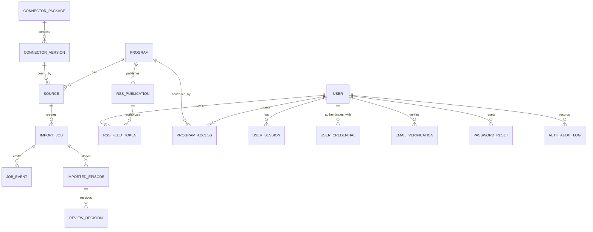
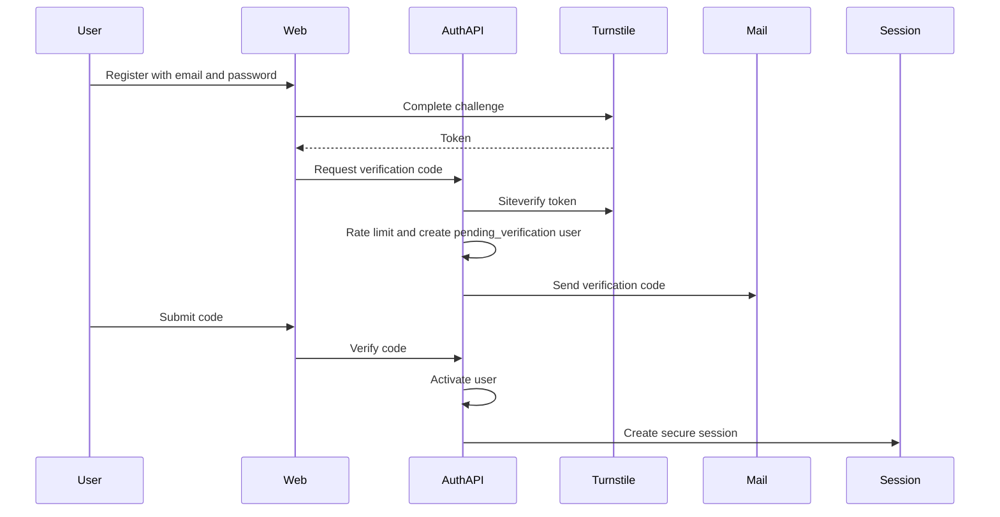
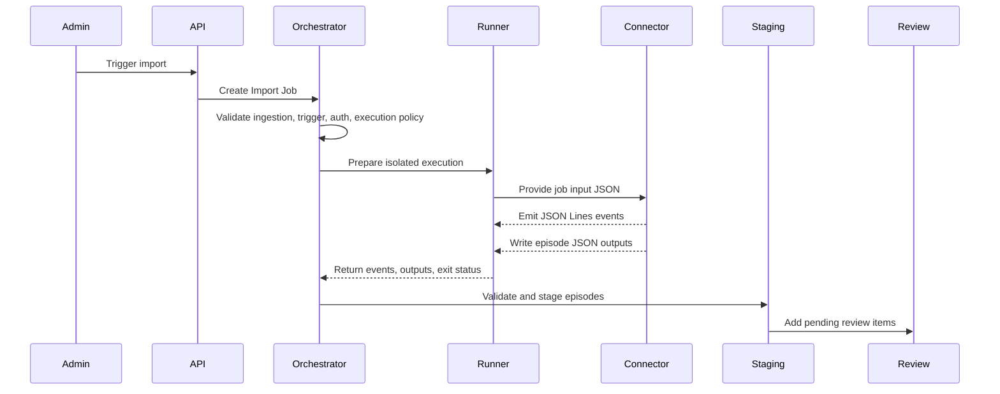
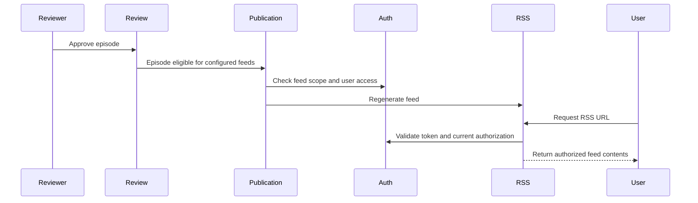
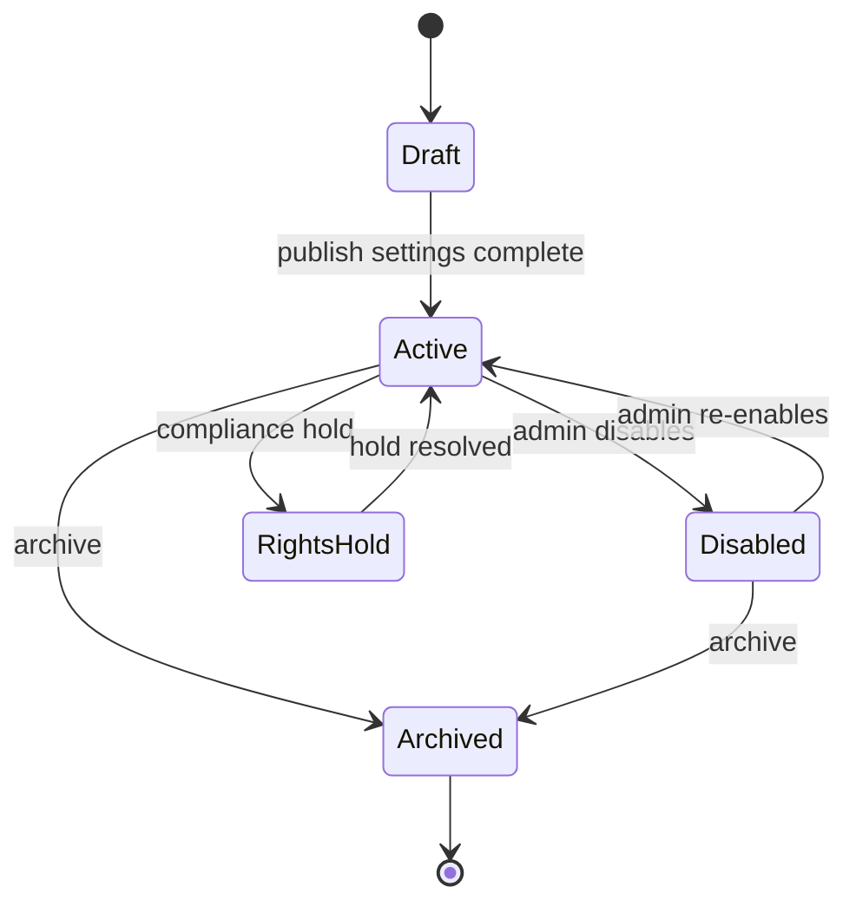
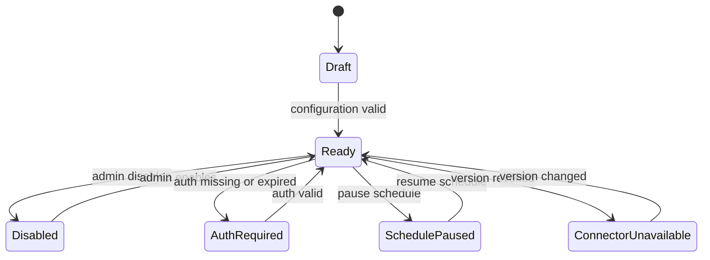
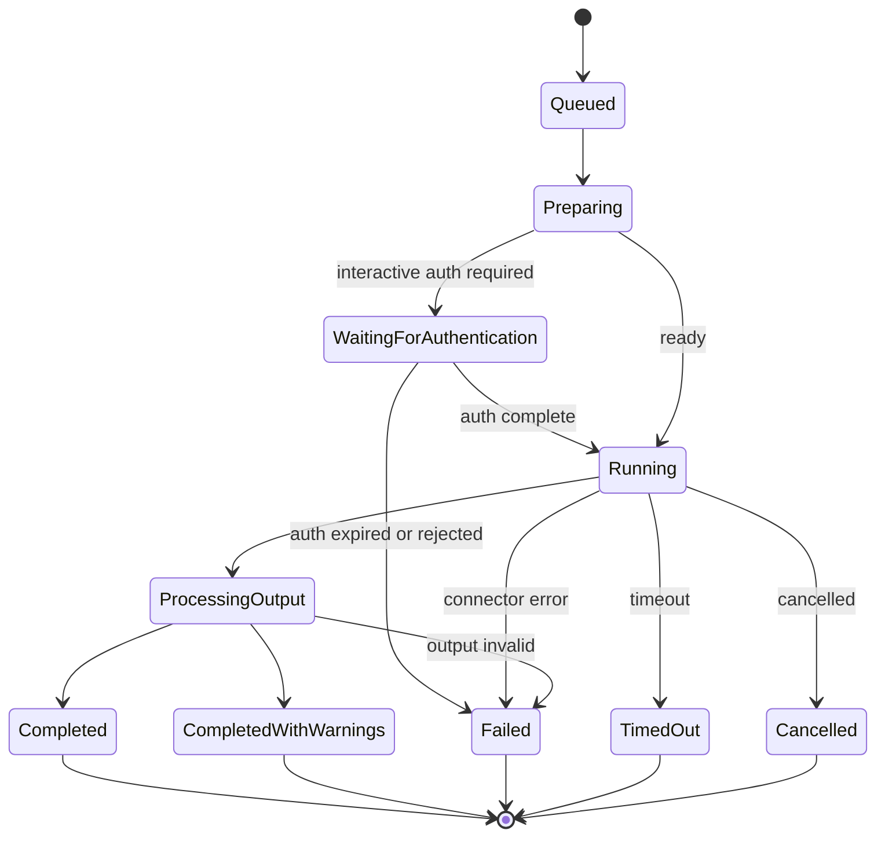
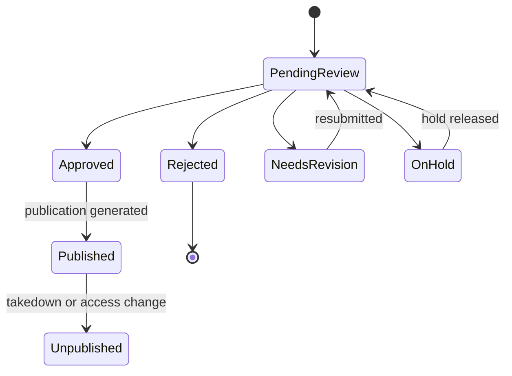
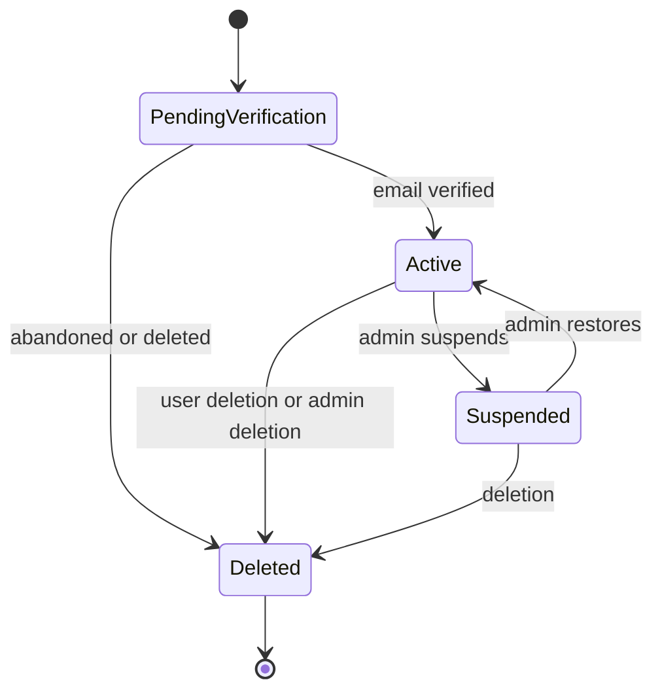

# Podcast Hub Architecture

## 1. Architectural Goals

The architecture must prioritize:

- Extensibility for multiple content sources.
- Traceable import and publication workflows.
- Strict permission isolation.
- Human intervention for authentication, review, and compliance.
- Connector package governance.
- Safe execution boundaries.
- Future support for additional runtimes without changing the core job protocol.

Frozen long-term backend architecture:

- Go as the platform main backend.
- PostgreSQL as the main database.
- Redis for cache, rate limiting, and task queue.
- S3-compatible object storage for authorized media and task artifacts.
- Python only for Connector SDK and Connector execution environments.
- Python FastAPI is not used as the platform main API.

Frozen M0 frontend stack:

- React, TypeScript, Vite, pnpm, React Router, Tailwind CSS, CSS Variables, lucide-react, and Playwright.

## 2. System Boundary

Podcast Hub owns:

- User registration, login, session, account status, and role authorization.
- Program metadata and lifecycle.
- Source configuration.
- Connector package registry.
- Native RSS built-in Importer contract.
- Import job orchestration.
- Connector execution sandbox contract.
- Episode staging and review.
- RSS publication and authorization.
- Audit logs and operational state.

Podcast Hub does not own:

- External platform authentication systems.
- External content rights.
- External podcast client behavior.
- Connector-internal business logic beyond the platform contract and safety policy.

## 3. Logical Components

### 3.1 Admin Web App

Provides management UI for Programs, Sources, Connectors, Jobs, Reviews, Publications, Users, and Audit Logs.

### 3.2 User Web App

Provides registration, login, password reset, authorized Program browsing, personal collections, RSS URL management, and future account session management.

### 3.3 API Layer

Owns all platform commands and queries. All UI actions go through the API layer, including:

- Registration, login, logout, password reset, session reads, and session revocation.
- Program changes.
- Source configuration.
- Connector upload and approval.
- Job trigger requests.
- Review decisions.
- Publication changes.
- User access changes.

### 3.4 Domain Service Layer

Encapsulates business policies:

- User authentication and account status policy.
- Program lifecycle policy.
- Source scheduling policy.
- Connector compatibility policy.
- Job state transitions.
- Review and publication gates.
- Authorization checks.
- Rights policy enforcement.

### 3.5 Connector Registry

Stores Connector package metadata, validation results, approval state, and package artifact references.

The registry does not execute Connectors directly. It provides immutable package versions to the job runner.

### 3.6 Job Orchestrator

Owns Import Job lifecycle:

- Accepts Source jobs described by `ingestion_type`, `trigger_type`, `auth_mode`, and `execution_mode`.
- Creates immutable job input snapshots.
- Enforces auth and scheduling rules.
- Hands executable work to isolated runners.
- Collects status, events, outputs, and errors.
- Creates manual todos when required.

### 3.7 Isolated Connector Runner

Executes a Connector in a restricted environment.

M1.2B introduces the Runner protocol boundary without Docker. The API service creates and exposes Import Job metadata only. A separate `cmd/runner` can claim one queued Job in explicit `RUNNER_MODE=fixture_subprocess` mode, write `/work/input/job.json`, execute a test fixture subprocess, parse stdout JSON Lines, validate declared output artifacts, persist redacted Job Events and Artifact metadata, then clean its workspace.

M1.2B Runner boundaries:

- Fixture execution only; no real duoting or external Connector execution.
- No Docker, Docker socket, container runtime, scheduled runner loop, QR, or interactive job support.
- `job.json` contains job/source/connector identifiers and policy metadata only; it must not contain Secret values.
- API service does not execute Connector code, read runner workspaces, read Secret plaintext, or call Docker.
- Artifacts are metadata only: relative path, size, SHA-256, and artifact type.
- Internal workspace paths and file contents are not returned by API responses.

M1.2C adds `RUNNER_MODE=docker_trusted_admin` for Alpha fixture execution. This mode is for administrator-trusted Connector packages only. It is not a complete hostile multi-tenant sandbox and must not be described as safe for arbitrary third-party code.

M1.2C Docker boundary:

- API service still does not require or use Docker socket access.
- Only the separate Runner process may have Docker execution capability.
- Connector containers are created with `privileged=false`, non-host networking, non-root user, read-only root filesystem, CPU limit, memory limit, PID limit, and execution timeout.
- `/work` is the only writable workspace mount.
- Connector package content is mounted read-only at `/connector`.
- Docker socket and host root are not mounted into Connector containers.
- Cancellation requests stop running execution and transition the Job to `cancelled`.
- Timeouts stop running execution and transition the Job to `failed` with `failure_code=timeout`.
- Domain-level network allowlist enforcement is not implemented in M1.2C; any allowlist is policy metadata only until a later network-control phase.

M1.2D adds the internal Alpha operating surface:

- Admin web pages expose Import Job list/detail, manual Source trigger, cancellation, redacted events, Artifact metadata, and disabled Runner reason.
- `/healthz` reports API and dependency health without requiring authentication and without returning secrets.
- `docker-compose.alpha.yml` prepares local/internal API, PostgreSQL, Redis, and Mailpit services.
- Runner startup remains separate from API startup; API containers do not mount the Docker socket.
- Alpha deployment is local/internal only and does not provide public HTTPS, RSS, user catalog, real external Connectors, or production hosting.

M1.2E adds the Runner integration and Secret boundary:

- Real Docker fixture smoke test is available only with `RUNNER_INTEGRATION_TEST=1`.
- API service still does not mount or use Docker socket.
- Separate Runner compose is provided at `deploy/docker-compose.runner-alpha.yml`.
- Runner may mount Docker socket; Connector containers must not.
- Runner decrypts Source-bound Secrets only after claiming a Job and writes them only to temporary `/work/secrets` files.
- `job.json` exposes only Secret logical file references, not values.
- Secret files are deleted with the job workspace.
- No Program, Episode, Review, RSS, media download, scheduled, interactive, QR, Telegram, or duoting capability is introduced.

Required properties:

- Non-root user.
- Temporary workspace.
- CPU limit.
- Memory limit.
- Disk limit.
- Execution timeout.
- Restricted network access.
- No host filesystem mount.
- No Docker socket.
- No production secret access.
- No database or Redis access.

The runner receives a prepared job input and emits structured events and output artifacts back to the orchestrator.

### 3.8 Episode Staging Service

Validates standardized episode JSON outputs and creates Imported Episodes.

Responsibilities:

- Schema validation.
- Required metadata checks.
- Duplicate candidate detection.
- Artifact reference validation.
- Linkage to Program, Source, Job, and Connector version.

### 3.9 Review Service

Owns review states and decisions.

Responsibilities:

- Review queue construction.
- Approval, rejection, hold, and revision decisions.
- Reviewer permissions.
- Decision audit trail.
- Publication gate integration.

### 3.10 RSS Publication Service

Generates and serves RSS feeds based on approved episodes and authorization policy.

Responsibilities:

- Feed scope enforcement.
- User-specific RSS token validation.
- Real-time RSS request authorization.
- Collection feed composition.
- Feed regeneration.
- Previous-valid-feed retention on generation failure.

### 3.11 Audit Service

Records sensitive platform actions:

- Connector upload, approval, deprecation, revocation.
- Source configuration changes.
- Job trigger, retry, cancellation.
- Authentication todo lifecycle.
- Review decisions.
- Publication changes.
- User access grants and revocations.
- RSS token regeneration and revocation.
- Authentication events such as registration, login, logout, password reset, session revocation, role changes, suspension, and deletion.

Audit snapshots must redact secrets and session material.

### 3.12 Authentication Service

Owns product user authentication.

Responsibilities:

- Email registration.
- Cloudflare Turnstile server-side verification.
- Email verification code lifecycle.
- Login and failed attempt handling.
- Password reset proof lifecycle.
- Argon2id password hashing policy.
- Secure session creation and revocation.
- User role and status checks.
- Authentication audit events.

The Authentication Service is separate from Connector source authentication. Connector source authentication handles external content source sessions; user authentication handles Podcast Hub accounts.

### 3.13 Native RSS Importer

The Native RSS Importer is platform built-in.

Responsibilities:

- Import authorized native RSS feeds.
- Use `ingestion_type: native_rss`.
- Use `auth_mode: none`.
- Use `execution_mode: unattended`.
- Support `trigger_type: manual` and `trigger_type: scheduled`.
- Normalize RSS items into Imported Episodes.
- Send all staged episodes through review before publication.

Native RSS is not an administrator-uploaded Connector ZIP.

## 4. Core Data Relationships

Source execution dimensions:

- `ingestion_type`: `native_rss`, `connector`, or `manual_upload`.
- `trigger_type`: `manual` or `scheduled`.
- `auth_mode`: `none`, `reusable_session`, or `qr_each_run`.
- `execution_mode`: `unattended` or `interactive`.

## 5. Authentication Data Flow

## 6. Import Data Flow

## 7. Publication Data Flow

## 8. State Machines

### 8.1 Program Lifecycle

### 8.2 Source Lifecycle

### 8.3 Import Job Lifecycle

### 8.4 Episode Review Lifecycle

### 8.5 User Account Lifecycle

## 9. Connector Execution Boundary

Connectors may:

- Read the standard job input JSON.
- Read files included in their own package.
- Write output only to the assigned temporary output directory.
- Emit JSON Lines events to stdout.
- Access the network only according to source policy and runner restrictions.

Connectors must not:

- Write to production database tables.
- Connect to Redis.
- Access the Docker socket.
- Read host filesystem paths.
- Read production secrets.
- Generate formal RSS XML.
- Run as daemons.
- Schedule themselves.
- Persist session material outside platform-approved storage.

## 10. Permission Model

Permission checks must occur at the API and domain policy layer.

Recommended permission groups:

- `auth.register`
- `auth.login`
- `account.session.view`
- `account.session.revoke`
- `admin.program.manage`
- `admin.source.manage`
- `admin.connector.upload`
- `admin.connector.approve`
- `admin.job.operate`
- `admin.review.decide`
- `admin.publication.manage`
- `admin.user_access.manage`
- `admin.audit.view`
- `user.program.view`
- `user.collection.manage`
- `user.rss.manage`

Role rules:

- Public registration grants only `user`.
- `admin` requires trusted initialization or existing admin grant.
- Suspended or deleted accounts cannot exercise user or admin permissions.

Sensitive operations require audit events.

## 11. Extensibility Strategy

### 11.1 New Source Types

Add a new Source type only when:

- It can map into the standard Import Job model.
- It can produce standardized Imported Episodes.
- It can follow rights and review policy.

### 11.2 New Connector Runtime

Future runtimes can be added by extending manifest runtime fields and runner adapters. The job input, JSON Lines events, and episode output schema should remain stable.

### 11.3 Multi-Source Merge

Episodes should keep source provenance and stable external identifiers. Merge behavior should be policy-driven:

- Prefer exact source episode ID when present.
- Fallback to canonical URL.
- Fallback to normalized title and publication date.
- Flag uncertain matches for review.

## 12. Observability

Required signals:

- Job state transition count and latency.
- Connector version failure rate.
- Authentication todo age.
- Review queue age.
- Feed generation success and failure.
- RSS request count and authorization failures.
- Runner timeout and resource-limit failures.
- Registration, login, password reset, and session revocation rates.
- Authentication failure and rate-limit counts.

Logs must be structured and redacted.

## 13. Reliability Rules

- Job input snapshots are immutable.
- Connector package versions are immutable after approval.
- Job retries create new attempts or clearly linked retry records.
- Feed generation should preserve the last valid feed on failure.
- RSS requests must validate token, user status, current access, and publication state in real time.
- Cache must not bypass RSS authorization.
- Audit records are append-only.
- Output artifact validation errors should not corrupt existing approved episodes.
- Verification codes and reset proofs are single-use and short-lived.
- Password reset invalidates old sessions.
## M1.1A Connector Registry Increment

- Added platform-side Connector Registry tables: `connectors`, `connector_versions`, `connector_events`.
- Added admin-only registry APIs for upload, validation result query, review actions, and connector enable/disable.
- Added development filesystem package store under `.local/connector-packages/` for quarantine and approved artifacts.
- Upload pipeline is static and safety-first: no Python execution, no shell execution, no Docker, no media ingestion.
- Program/Source/ImportJob pipelines remain outside M1.1A implementation scope.

## M1.1B Source And Secret Reference Increment

- Added `connector_sources`, `secret_records`, `source_secret_bindings`, and `source_events`.
- Source is a Connector configuration instance and does not create Program or Episode records.
- Secret values are encrypted with AES-GCM and exposed only as metadata plus binding state.
- Alpha supports only manual + none/reusable_session + unattended Source creation.
- Connector execution, ImportJob creation, staging review, RSS, scheduled jobs, interactive/QR jobs, real duoting, untrusted Connector isolation, and production deployment remain outside this phase.

## M1.2A Import Job Lifecycle Increment

- Added `import_jobs`, `import_job_events`, and `import_job_artifacts`.
- Import Jobs are admin-created metadata records tied to an active Source and approved ConnectorVersion.
- M1.2A validates Source, Connector, Version, Secret binding, manual trigger, and one-active-job-per-Source rules before queueing.
- M1.2A does not execute Connector code, does not call Docker, and does not create Program, Episode, RSS, or user-visible media.
- Running cancellation records `cancellation_requested_at`; actual process termination is deferred to Runner phases.
