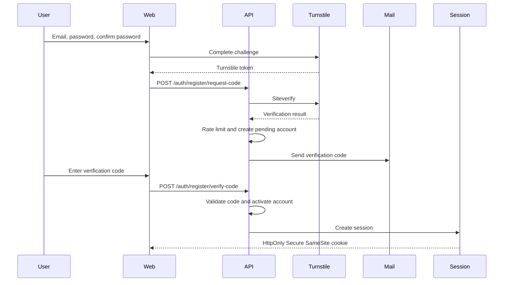

# Authentication

## 1. Scope

This document defines user registration, login, password reset, session handling, authentication audit, and account security rules for Podcast Hub.

It covers normal product users and administrators. It does not cover external source authentication used by Connectors; Connector source authentication is documented in `AUTH_AND_SCHEDULING.md`.

## 2. Roles

Supported roles:

- `user`: default role for newly registered accounts.
- `admin`: privileged role for platform administration.

Rules:

- Public administrator registration is not allowed.
- A newly registered account is always `user`.
- `admin` can be created only during trusted system initialization or granted by an existing authorized administrator.
- M1.0C provides local bootstrap via CLI only: `go run ./cmd/admin seed --email admin@example.invalid`.
- No public HTTP API may create or upgrade admin accounts.
- Role changes must be audited.
- Role checks must happen on the server side for every protected API.
- `System Owner`, `Operator`, and `Reviewer` are not separate account roles; they are admin responsibility labels or permission profiles.
- Invitations are not implemented in M0 and must not add Invitation API or User status.

## 3. User Status

Supported user statuses:

- `pending_verification`: account exists but email verification is not complete.
- `active`: account can log in and use authorized product features.
- `suspended`: account is temporarily blocked from login and RSS access.
- `deleted`: account is logically deleted or anonymized according to retention policy.

Do not use `Pending invite` or `Disabled User` as User statuses.

Status behavior:

| Status | Login | RSS access | Admin access | Notes |
| --- | --- | --- | --- | --- |
| `pending_verification` | No | No | No | User must complete email verification. |
| `active` | Yes | Yes, according to authorization | Yes, if role is `admin` | Normal state. |
| `suspended` | No | No | No | Existing sessions should be revoked or denied. |
| `deleted` | No | No | No | Data retention follows policy. |

## 4. Registration Flow

Default flow:

1. User enters email, password, and password confirmation.
2. User completes Cloudflare Turnstile in the frontend.
3. Frontend receives a Turnstile token.
4. Frontend sends registration request to the backend.
5. Backend verifies the Turnstile token with Cloudflare Siteverify.
6. Backend applies email, IP, and device rate limits.
7. Backend creates or updates a `pending_verification` account.
8. Backend stores only a hashed email verification code.
9. Backend sends an email verification code.
10. User enters the verification code.
11. Backend validates code, expiry, attempt count, and single-use state.
12. Backend activates the account.
13. Backend creates a secure login session.



User-visible requirements:

- Registration page must not imply admin self-service registration.
- Verification page should allow resending a code subject to Turnstile and rate limits.
- Error copy must be helpful without revealing sensitive account existence details.

## 5. Login Flow

Default flow:

1. User enters email and password.
2. Backend checks rate limits and failed-attempt counters.
3. Backend verifies credentials.
4. Backend may require Turnstile for high-risk or abnormal login attempts.
5. Backend creates a secure session after successful login.

Security rules:

- Login failure messages must not reveal whether the email exists or the password is wrong.
- Repeated failures must trigger rate limits.
- High-risk login may require Turnstile.
- Suspended, deleted, or pending verification accounts must not receive active sessions.
- Login success and failure must be audited with redacted metadata.

## 6. Password Reset Flow

Default flow:

1. User starts password reset with email.
2. Backend applies rate limits and optional Turnstile.
3. Backend sends an email code or one-time link.
4. User submits verification proof and new password.
5. Backend validates proof.
6. Backend stores the new password with Argon2id.
7. Backend invalidates old sessions according to policy.
8. Backend sends a security notification email.

Rules:

- Password reset request response must not reveal whether the email exists.
- Reset proof must be single-use and short-lived.
- Reset success must invalidate existing sessions unless an explicit future policy allows keeping the current device.
- Security notification email must not contain the new password.

## 7. Verification Code Rules

Email verification and password reset codes must:

- Be single-use.
- Have a short validity period.
- Be rate-limited by email, IP, and device.
- Have a maximum number of incorrect attempts.
- Invalidate older codes when a new code is issued for the same purpose.
- Never be logged in full.
- Never be stored in plaintext.
- Be stored only as a secure hash with metadata.

Recommended metadata:

- Purpose.
- Email or user reference.
- Code hash.
- Expiration time.
- Consumed time.
- Attempt count.
- Issued IP hash or coarse IP metadata.
- Device fingerprint reference, if used.

## 8. Password Security

Rules:

- Passwords must be stored using Argon2id.
- Plaintext passwords are never stored.
- Reversible encrypted passwords are not allowed.
- Passwords must never be logged.
- Password validation errors should be clear without echoing the password.
- Password change and reset events must be audited.

Recommended password policy:

- Minimum length.
- Block common leaked or weak passwords when a safe local or service-based check is available.
- Do not impose unnecessary composition rules that encourage predictable passwords.

## 9. Session Security

Session cookies must be:

- `HttpOnly`
- `Secure`
- `SameSite`

Session lifecycle:

- Login creates a new session.
- Logout invalidates the current session.
- Password reset invalidates old sessions.
- Password change should invalidate other sessions by default.
- Account suspension invalidates or denies all sessions.
- Account deletion invalidates all sessions.

Future capability:

- Users should be able to view and revoke login devices.

The future device/session UI is represented by:

- `GET /account/sessions`
- `DELETE /account/sessions/{id}`

## 10. Cloudflare Turnstile

Turnstile is used for high-risk entry points:

- Registration code request.
- Resending verification code.
- Password reset request.
- High-risk or abnormal login attempts.

Rules:

- Frontend only obtains a Turnstile token.
- Backend must call Cloudflare Siteverify to validate the token.
- Expired, reused, or failed tokens must produce clear error states.
- Turnstile is not the only security control.
- Backend rate limiting, audit logging, and risk controls are still required.

Error states:

- `turnstile_required`
- `turnstile_expired`
- `turnstile_duplicate`
- `turnstile_failed`
- `turnstile_unavailable`

## 11. Data Model

### 11.1 `User`

Purpose:

- Represents the account identity.

Fields:

- `id`
- `email_normalized`
- `display_name`
- `status`
- `created_at`
- `updated_at`
- `verified_at`
- `deleted_at`

### 11.2 `UserCredential`

Purpose:

- Stores credential material for a User.

Fields:

- `user_id`
- `password_hash`
- `password_hash_algorithm`
- `password_updated_at`
- `failed_login_count`
- `locked_until`

### 11.3 `EmailVerification`

Purpose:

- Tracks email verification codes.

Fields:

- `id`
- `user_id`
- `email_normalized`
- `purpose`
- `code_hash`
- `expires_at`
- `consumed_at`
- `attempt_count`
- `max_attempts`
- `created_at`
- `replaced_at`

### 11.4 `PasswordReset`

Purpose:

- Tracks password reset proofs.

Fields:

- `id`
- `user_id`
- `email_normalized`
- `proof_hash`
- `proof_type`
- `expires_at`
- `consumed_at`
- `attempt_count`
- `max_attempts`
- `created_at`

### 11.5 `UserSession`

Purpose:

- Represents an active or revoked login session.

Fields:

- `id`
- `user_id`
- `session_hash`
- `created_at`
- `last_seen_at`
- `expires_at`
- `revoked_at`
- `revocation_reason`
- `ip_summary`
- `user_agent_summary`
- `device_label`

### 11.6 `AuthAuditLog`

Purpose:

- Stores authentication and account security events.

Fields:

- `id`
- `actor_user_id`
- `target_user_id`
- `event_type`
- `result`
- `ip_summary`
- `user_agent_summary`
- `risk_flags`
- `created_at`
- `metadata_redacted`

### 11.7 `UserRole`

Allowed values:

- `user`
- `admin`

### 11.8 `UserStatus`

Allowed values:

- `pending_verification`
- `active`
- `suspended`
- `deleted`

## 12. API Contract

### 12.1 Common Failure Response

All authentication endpoints should use a generic failure shape:

```json
{
  "error": {
    "code": "invalid_request",
    "message": "The request could not be completed.",
    "request_id": "req_01JZ8A00000000000000000000"
  }
}
```

Rules:

- Do not reveal whether an email exists unless the user is already authenticated and authorized to know.
- Do not reveal raw verification codes.
- Do not reveal password validation internals beyond safe user-facing policy.
- Do not reveal session secrets.

### 12.2 `POST /auth/register/request-code`

Purpose:

- Start registration and send an email verification code.

Request fields:

- `email`
- `password`
- `confirm_password`
- `turnstile_token`

Success response:

```json
{
  "status": "verification_required",
  "email_hint": "u***@example.com",
  "expires_in_seconds": 600,
  "resend_after_seconds": 60
}
```

Common failures:

- `invalid_email`
- `weak_password`
- `password_mismatch`
- `turnstile_required`
- `turnstile_failed`
- `rate_limited`
- `temporarily_unavailable`

Rate limits:

- By email.
- By IP.
- By device.
- By IP and email pair.

Permission:

- Public unauthenticated.

Audit:

- `auth.register_code_requested`
- `auth.register_code_rate_limited`
- `auth.turnstile_failed`

Must not reveal:

- Whether an already registered email is active.
- The verification code.
- Password details.
- Turnstile secret.

### 12.3 `POST /auth/register/verify-code`

Purpose:

- Verify email code, activate account, and create a login session.

Request fields:

- `email`
- `code`

Success response:

```json
{
  "status": "authenticated",
  "user": {
    "id": "user_01JZ8A11111111111111111111",
    "email": "user@example.com",
    "role": "user",
    "status": "active"
  }
}
```

Common failures:

- `invalid_or_expired_code`
- `too_many_attempts`
- `rate_limited`
- `account_unavailable`

Rate limits:

- By email.
- By IP.
- By device.
- Maximum incorrect attempts per code.

Permission:

- Public unauthenticated.

Audit:

- `auth.email_verified`
- `auth.email_verification_failed`
- `auth.session_created`

Must not reveal:

- Whether a different account exists.
- Full code values.
- Session secret.

### 12.4 `POST /auth/login`

Purpose:

- Authenticate with email and password.

Request fields:

- `email`
- `password`
- `turnstile_token`, required only when challenged.

Success response:

```json
{
  "status": "authenticated",
  "user": {
    "id": "user_01JZ8A22222222222222222222",
    "email": "user@example.com",
    "role": "user",
    "status": "active"
  }
}
```

Common failures:

- `invalid_credentials`
- `turnstile_required`
- `turnstile_failed`
- `rate_limited`
- `account_unavailable`

Rate limits:

- By email.
- By IP.
- By device.
- By account after failed attempts.

Permission:

- Public unauthenticated.

Audit:

- `auth.login_succeeded`
- `auth.login_failed`
- `auth.login_rate_limited`
- `auth.login_turnstile_required`

Must not reveal:

- Whether the email exists.
- Whether the password was wrong.
- Whether an account has an admin role before authentication succeeds.
- Password values.

### 12.5 `POST /auth/logout`

Purpose:

- Invalidate the current session.

Request fields:

- None required beyond the current session cookie.

Success response:

```json
{
  "status": "logged_out"
}
```

Common failures:

- `not_authenticated`
- `session_not_found`

Rate limits:

- Normal authenticated endpoint limits.

Permission:

- Authenticated user.

Audit:

- `auth.logout`

Must not reveal:

- Session secret.
- Other active session identifiers.

### 12.6 `POST /auth/password-reset/request`

Purpose:

- Request a password reset code or one-time link.

Request fields:

- `email`
- `turnstile_token`

Success response:

```json
{
  "status": "reset_instructions_sent_if_account_exists",
  "resend_after_seconds": 60
}
```

Common failures:

- `turnstile_required`
- `turnstile_failed`
- `rate_limited`
- `temporarily_unavailable`

Rate limits:

- By email.
- By IP.
- By device.
- By IP and email pair.

Permission:

- Public unauthenticated.

Audit:

- `auth.password_reset_requested`
- `auth.password_reset_rate_limited`

Must not reveal:

- Whether the email exists.
- Reset proof.
- Account status.

### 12.7 `POST /auth/password-reset/verify`

Purpose:

- Verify reset proof and set a new password.

Request fields:

- `email`
- `proof`
- `new_password`
- `confirm_password`

Success response:

```json
{
  "status": "password_reset",
  "sessions_revoked": true
}
```

Common failures:

- `invalid_or_expired_proof`
- `weak_password`
- `password_mismatch`
- `too_many_attempts`
- `rate_limited`

Rate limits:

- By email.
- By IP.
- By device.
- Maximum incorrect attempts per proof.

Permission:

- Public unauthenticated.

Audit:

- `auth.password_reset_succeeded`
- `auth.password_reset_failed`
- `auth.sessions_revoked_after_password_reset`

Must not reveal:

- Whether the email exists beyond generic reset outcome.
- Raw proof values.
- Password values.

### 12.8 `GET /auth/me`

Purpose:

- Return the current authenticated user.

Request fields:

- None.

Success response:

```json
{
  "user": {
    "id": "user_01JZ8A33333333333333333333",
    "email": "user@example.com",
    "display_name": "User",
    "role": "user",
    "status": "active"
  }
}
```

Common failures:

- `not_authenticated`
- `session_expired`
- `account_unavailable`

Rate limits:

- Normal authenticated endpoint limits.

Permission:

- Authenticated user.

Audit:

- Usually not required for every successful read.
- Audit repeated failures or suspicious use.

Must not reveal:

- Session secret.
- Password hash.
- Other users' data.

### 12.9 `GET /admin/me`

Purpose:

- Return minimal current admin identity for backend permission verification.

Success response:

```json
{
  "admin": {
    "id": "user_01JZ8A33333333333333333333",
    "email": "admin@example.invalid",
    "role": "admin",
    "status": "active"
  }
}
```

Permission:

- Admin only.

Failure:

- `not_authenticated` (401)
- `forbidden` (403)
- `account_unavailable` (403)

### 12.10 `GET /admin/system/status`

Purpose:

- Verify admin permission chain and dependency health summary.

Behavior:

- development: returns minimal health summary for API/database/redis/mail.
- production: returns restricted minimal status only.

Permission:

- Admin only.

Failure:

- `not_authenticated` (401)
- `forbidden` (403)

### 12.11 `GET /account/sessions`

Purpose:

- List the user's active login sessions.

Request fields:

- None.

Success response:

```json
{
  "sessions": [
    {
      "id": "sess_01JZ8A44444444444444444444",
      "current": true,
      "device_label": "Chrome on Windows",
      "ip_summary": "Shanghai, CN",
      "last_seen_at": "2026-06-26T09:00:00Z",
      "created_at": "2026-06-20T09:00:00Z"
    }
  ]
}
```

Common failures:

- `not_authenticated`
- `account_unavailable`

Rate limits:

- Normal authenticated endpoint limits.

Permission:

- Authenticated user.

Audit:

- `auth.sessions_viewed`, optional or sampled.

Must not reveal:

- Session hashes.
- Raw IP addresses if policy requires coarse summaries.
- Other users' sessions.

### 12.12 `DELETE /account/sessions/{id}`

Purpose:

- Revoke one login session owned by the current user.

Request fields:

- Path parameter: `id`

Success response:

```json
{
  "status": "session_revoked",
  "session_id": "sess_01JZ8A44444444444444444444"
}
```

Common failures:

- `not_authenticated`
- `session_not_found`
- `not_allowed`
- `rate_limited`

Rate limits:

- Normal authenticated endpoint limits.
- Stricter limits for repeated revocation attempts.

Permission:

- Authenticated user.
- User can revoke only their own sessions unless an admin endpoint is added later.

Audit:

- `auth.session_revoked`

Must not reveal:

- Whether a session ID belongs to another user.
- Session secret.

## 13. UI Requirements

Authentication UI must include:

- Registration page.
- Email verification page.
- Login page.
- Password reset request page.
- Password reset confirmation page.
- Account sessions page as a later capability.

Required states:

- Loading.
- Empty or initial state.
- Validation error.
- Turnstile required.
- Turnstile failed.
- Code sent.
- Code expired.
- Too many attempts.
- Success.

## 14. Audit Events

Required events:

- `auth.register_code_requested`
- `auth.email_verified`
- `auth.login_succeeded`
- `auth.login_failed`
- `auth.logout`
- `auth.password_reset_requested`
- `auth.password_reset_succeeded`
- `auth.password_reset_failed`
- `auth.session_revoked`
- `auth.role_changed`
- `auth.user_suspended`
- `auth.user_deleted`

Audit logs must redact:

- Passwords.
- Verification codes.
- Reset proofs.
- Session secrets.
- Turnstile secrets.

## 15. Acceptance Criteria

Before authentication implementation can be considered complete in a later phase:

- Public registration creates only `user` accounts.
- Admin self-registration is impossible.
- Email verification is required before activation.
- Turnstile token is verified server-side.
- Verification codes are hashed, short-lived, single-use, rate-limited, and attempt-limited.
- Passwords use Argon2id.
- Login failures do not reveal whether email or password was wrong.
- Sessions use `HttpOnly`, `Secure`, `SameSite` cookies.
- Logout and password reset have explicit session invalidation behavior.
- Security-sensitive events are audited.
- Screenshots cover desktop, mobile, error, loading, long text, and permission states.
