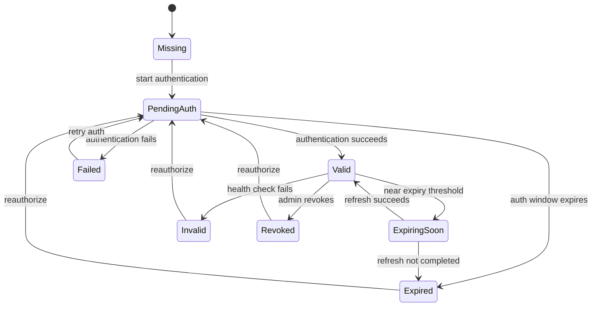
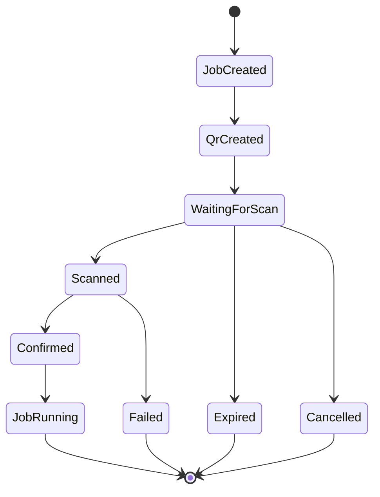
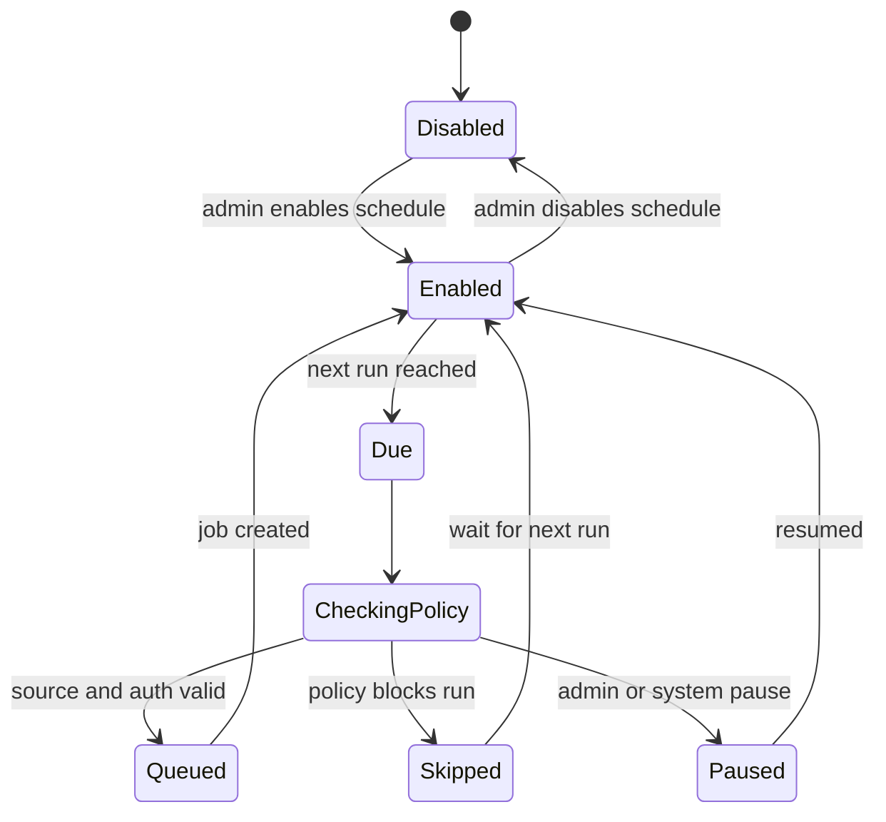

# Connector Authentication and Scheduling

## 1. Goals

Connector source authentication and scheduling are platform-owned responsibilities.

The design must ensure:

- Connectors do not schedule themselves.
- Connectors do not persist or expose credentials.
- QR-each-run sources cannot run on schedule.
- Reusable sessions can run on schedule only while valid.
- Manual imports are never scheduled.
- Human intervention is explicit, auditable, and recoverable.

## 2. Frozen Source Dimensions

Use four separate dimensions:

- `ingestion_type`: `native_rss`, `connector`, `manual_upload`.
- `trigger_type`: `manual`, `scheduled`.
- `auth_mode`: `none`, `reusable_session`, `qr_each_run`.
- `execution_mode`: `unattended`, `interactive`.

The frozen scheduled trigger value is `scheduled`.
Do not use `manual_import` or `interactive_auth` as trigger values.

## 3. Valid Combinations

| ingestion_type | auth_mode | trigger_type | execution_mode | Rule |
| --- | --- | --- | --- | --- |
| `native_rss` | `none` | `manual` or `scheduled` | `unattended` | Built-in Importer, not Connector ZIP. |
| `connector` | `none` | `manual` or `scheduled` | `unattended` | No source auth required. |
| `connector` | `reusable_session` | `manual` or `scheduled` while valid | `unattended` | Expired session creates admin attention state. |
| `connector` | `qr_each_run` | `manual` only | `interactive` | No scheduled runs. |
| `manual_upload` | `none` | `manual` only | `interactive` | No Connector execution. |

## 4. Authentication Modes

### 4.1 `none`

Description:

- No authentication required for the Source.

Allowed trigger types:

- Manual.
- Scheduled.

States:

- `not_required`

### 4.2 `reusable_session`

Description:

- A platform-managed session is reused across jobs until it expires, is revoked, or fails health checks.

Allowed trigger types:

- Manual.
- Scheduled while session is valid.
- Manual reauthorization to create or refresh the session.

States:

- `missing`
- `pending_auth`
- `valid`
- `expiring_soon`
- `expired`
- `revoked`
- `invalid`

If a reusable session becomes invalid, scheduled jobs are not retried indefinitely. The Source or Job enters a waiting authorization or admin attention state.

### 4.3 `qr_each_run`

Description:

- Every import job needs a fresh QR authentication step.

Allowed trigger types:

- Manual.

Not allowed:

- Scheduled.

States:

- `not_started`
- `qr_created`
- `waiting_for_scan`
- `scanned`
- `confirmed`
- `expired`
- `cancelled`
- `failed`

### 4.4 Manual Upload

Description:

- Administrator uploads audio and metadata directly.

Allowed triggers:

- Manual upload only.

Not allowed:

- Scheduled.
- Connector execution.

States:

- `ready_for_upload`
- `uploading`
- `uploaded`
- `validation_failed`
- `staged`

## 5. Trigger Types

### 5.1 `manual`

Created by an administrator or operator.

Allowed for:

- `none`
- `reusable_session`
- `qr_each_run`
- `manual_upload` ingestion through the human upload workflow

### 5.2 `scheduled`

Created by the platform scheduler.

Allowed for:

- `none`
- `reusable_session` with valid session.

Blocked for:

- `qr_each_run`
- `manual_upload`

### 5.3 System Retry Trigger

Created by platform retry policy.

Allowed only when:

- Original failure is retryable.
- Source is still active.
- Connector version is still allowed.
- Authentication state is valid or can be refreshed.
- Retry limit has not been exceeded.

## 6. Reusable Session State Machine

Scheduling behavior:

- `valid`: scheduled jobs may run.
- `expiring_soon`: scheduled jobs may run if policy allows and the job deadline is before expiration.
- `expired`, `invalid`, `revoked`, `missing`: scheduled jobs are skipped and a todo may be created.
- `pending_auth`: scheduled jobs are not started.

## 7. QR Each Run State Machine

Rules:

- QR state belongs to the platform job, not a reusable source session.
- QR material must not be stored in logs.
- Expired QR jobs cannot be resumed; retry creates a new job.
- `qr_each_run` Sources cannot define a schedule.
- QR jobs must support expiration, interaction timeout, cancellation, and failure states.

## 8. Scheduler State Machine

Skipped run reasons:

- Source disabled.
- Program disabled.
- Connector version revoked.
- Auth session expired.
- `qr_each_run` mode.
- `manual_upload` ingestion type.
- Prior job still running and overlap not allowed.

## 9. Source Scheduling Configuration

Recommended fields:

- `enabled`
- `interval_minutes`
- `timezone`
- `start_after`
- `end_before`
- `allow_overlap`
- `max_retries`
- `retry_backoff`
- `skip_if_review_backlog_exceeds`

Default policy:

- No overlapping jobs for the same Source.
- Backoff after repeated failures.
- Pause after repeated policy or auth failures.
- Log skipped runs as scheduler events.

## 10. Manual Todos

Manual todos are created when:

- QR scan is required.
- Reusable session has expired.
- Connector version was revoked and source needs migration.
- Job output requires operator attention.
- Review queue contains policy warnings.

Todo fields:

- Todo ID.
- Type.
- Related Program, Source, Job, or Episode.
- Status.
- Assignee.
- Due time.
- Expiration time, if applicable.
- Resolution note.
- Audit actor and timestamp.

Todo states:

- `open`
- `assigned`
- `in_progress`
- `completed`
- `expired`
- `cancelled`

## 11. Authentication Safety Rules

- Do not request server root passwords, SSH private keys, platform account passwords, cookies, or real tokens.
- Do not store raw QR session data in logs.
- Do not expose session material to UI users.
- Do not pass production secrets into Connector packages.
- Use opaque session references where possible.
- Redact known secret field names from logs and audit snapshots.

## 12. Operational Recovery

Common recovery actions:

- Retry job after transient source failure.
- Reauthorize reusable session.
- Create a new QR run after QR expiration.
- Disable schedule after repeated failures.
- Upgrade Source to a fixed Connector version.
- Put Program or Source on rights hold.

Recovery actions must be auditable.
