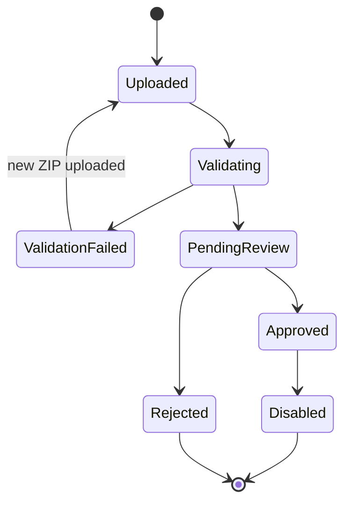
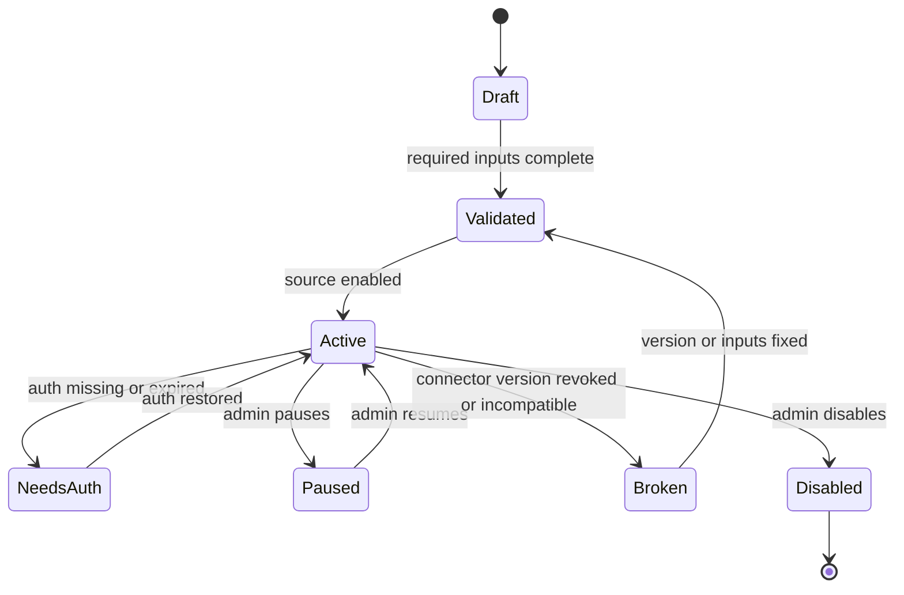
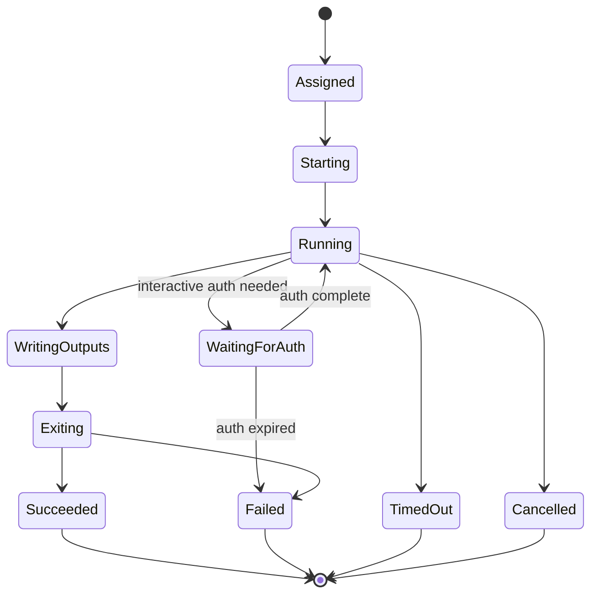

# Connector Specification

## 1. Scope

Phase 1 supports Python Connectors only.

M1.1A implements only package upload, static validation, version registration, review, and enable/disable control.
M1.1A does not execute connector packages and does not create Program/Source/ImportJob data.

A Connector is a versioned ZIP package that performs one authorized import task for one Source and exits. It is not a daemon, scheduler, crawler marketplace, RSS generator, database writer, or secret manager.

The platform controls:

- Connector package upload and validation.
- Connector version approval and revocation.
- Connector registry metadata and audit events.

The Connector controls only:

- Source-specific import logic within the approved job scope.
- Emitting structured job events.
- Producing standardized episode output JSON files.
- Writing allowed artifacts into the assigned output directory.

## 2. Package Requirements

Every Connector must be uploaded as a ZIP file.

Required files:

- `manifest.yaml`
- Entrypoint source file (for example `src/connector.py`)
- Dependency lock file, for example `requirements.lock`
- `README.md`

Optional in M1.1A:

- `tests/`
- `fixtures/`

Recommended package layout:

```text
example_connector.zip
  manifest.yaml
  README.md
  connector.py
  requirements.lock
  tests/
    test_manifest_contract.py
    test_sample_output.py
  samples/
    job_input.json
    events.jsonl
    output/
      episodes/
        episode-001.json
      artifacts/
        cover.jpg
```

The ZIP package must not contain:

- Secrets.
- Cookies.
- Session files.
- SSH keys.
- Database credentials.
- Production tokens.
- Compiled binaries that are not declared and approved.
- Hidden scripts intended to bypass the declared entrypoint.

## 3. Manifest

### 3.1 Required Manifest Fields

```yaml
schema_version: "1.0"
connector:
  id: "example_authorized_source"
  name: "Example Authorized Source"
  version: "0.1.0"
  description: "Imports authorized episode metadata and media references from Example Source."
  runtime: "python"
  runtime_version: "3.12"
  entrypoint: "connector.py"
  license: "internal"
  homepage: "https://example.invalid/docs/source"

package:
  dependency_lock: "requirements.lock"
  readme: "README.md"
  tests:
    - "tests/test_manifest_contract.py"
    - "tests/test_sample_output.py"
  sample_output: "samples/output"

capabilities:
  supported_trigger_types:
    - "manual"
    - "scheduled"
  supported_auth_modes:
    - "none"
    - "reusable_session"
  supported_execution_modes:
    - "unattended"
  network:
    required: true
    allowed_hosts:
      - "api.example.invalid"
      - "media.example.invalid"
  output:
    episode_json: true
    media_files: true
    cover_files: true

inputs:
  fields:
    - name: "source_base_url"
      type: "url"
      required: true
      secret: false
      description: "Authorized source base URL."
    - name: "program_external_id"
      type: "string"
      required: true
      secret: false
      description: "Program identifier assigned by the source."
    - name: "import_limit"
      type: "integer"
      required: false
      default: 20
      min: 1
      max: 100
      secret: false

auth:
  mode: "reusable_session"
  session_required: true
  qr_required_each_run: false
  session_health_check: true

scheduling:
  allow_scheduled: true
  minimum_interval_minutes: 60

limits:
  timeout_seconds: 900
  max_output_mb: 2048
  max_episode_count: 100

output_contract:
  episode_schema_version: "1.0"
  event_schema_version: "1.0"

maintainers:
  - name: "Podcast Hub Operator"
    contact: "ops@example.invalid"
```

### 3.2 Manifest Compatibility Rules

- `connector.runtime` must be `python` in phase 1.
- `connector.version` must follow semantic versioning.
- `connector.entrypoint` must point to a file inside the ZIP.
- `package.dependency_lock`, `package.readme`, tests, and sample output must exist.
- `auth.mode: qr_each_run` must set `scheduling.allow_scheduled: false` and requires `execution_mode: interactive`.
- Secret input fields are allowed only as references supplied by the platform, never as literal secret values committed in the package.
- `allowed_hosts` is an intended policy declaration; enforcement belongs to the runner.

## 4. Frozen Source Dimensions

Connector execution uses four separate dimensions:

- `ingestion_type`: always `connector` for uploaded Connector ZIP packages.
- `trigger_type`: `manual` or `scheduled`.
- `auth_mode`: `none`, `reusable_session`, or `qr_each_run`.
- `execution_mode`: `unattended` or `interactive`.

Do not use `manual_import` or `interactive_auth` as trigger values.

## 5. Supported Trigger Types

### 5.1 `manual`

An administrator or operator explicitly starts a job.

Allowed auth modes:

- `none`
- `reusable_session`
- `qr_each_run`

### 5.2 `scheduled`

The platform scheduler starts a job according to Source configuration.

Allowed auth modes:

- `none`
- `reusable_session`, only while session is valid.

Not allowed:

- `qr_each_run`
- `manual_upload`

## 6. Authentication Modes

### 6.1 `none`

No source authentication is required.

Scheduling:

- May run manually.
- May run on schedule.
- Requires `execution_mode: unattended`.

### 6.2 `reusable_session`

The platform manages a reusable session that remains valid until expiration, revocation, or source-side invalidation.

Scheduling:

- May run manually.
- May run on schedule only while session is valid.
- Requires `execution_mode: unattended`.
- Session expiry must not cause infinite retries; the job or Source moves to a waiting authorization or admin attention state.

Connector obligations:

- Accept session material only through platform-approved runtime injection.
- Never print session data.
- Never write session data to output artifacts.

### 6.3 `qr_each_run`

Each job requires a fresh QR authentication step.

Scheduling:

- May run manually.
- Cannot run on schedule.
- Requires `execution_mode: interactive`.

Connector obligations:

- Emit QR-needed event when instructed by the platform protocol.
- Wait only within platform-defined timeout.
- Exit after the one import attempt.

## 7. Manual Upload Is Not a Connector

`manual_upload` does not execute a Connector and is not represented by a Connector package.

Rules:

- No Connector entrypoint.
- No Connector runtime.
- No scheduled execution.
- Administrator uploads media and episode metadata through a human import workflow.
- Output enters review before publication.

## 8. Connector Package Lifecycle (M1.1A)



State meanings:

- `Uploaded`: ZIP artifact received, not trusted.
- `Validating`: platform checks structure, manifest, sample output, and policy.
- `ValidationFailed`: package cannot be approved without changes.
- `PendingReview`: validation passed, awaiting authorized human approval.
- `Approved`: package becomes selectable for future Source binding phases.
- `Disabled`: approved package is no longer available for future Source binding.

## 15. M1.1A explicit non-goals

- No Python execution.
- No Docker build/run.
- No Program creation.
- No Source creation/binding.
- No ImportJob execution.
- No episode staging/review/RSS publishing.
- No secret upload/storage in connector package or manifest values.

## 9. Connector Configuration Lifecycle



## 10. Connector Execution Lifecycle



Connector execution is one attempt only. Retries are new platform-managed attempts.

## 11. Runtime Contract

The runner provides:

- Job input JSON path.
- Output directory path.
- Temporary workspace path.
- Redacted environment variables required by the protocol.
- Runtime limits.

The Connector must:

- Read the job input.
- Emit JSON Lines events to stdout.
- Write episode JSON files under the assigned output directory.
- Exit with a meaningful exit code.

The Connector must not:

- Read arbitrary host paths.
- Write outside the assigned output directory.
- Open local database sockets.
- Read production secrets.
- Generate final RSS XML.
- Start a background service.
- Schedule future runs.

## 12. Output Requirements

Minimum output structure:

```text
output/
  episodes/
    episode-001.json
  artifacts/
    audio/
      episode-001.mp3
    images/
      episode-001-cover.jpg
  summary.json
```

`summary.json` is optional in phase 1 but recommended for operator diagnostics.

## 13. Versioning

Connector versions are immutable after approval.

Version changes:

- Patch version: bug fix with no manifest contract changes.
- Minor version: backward-compatible input or output extension.
- Major version: breaking input, auth, output, or behavior change.

Sources should pin an exact Connector version. Version upgrades should be explicit and auditable.

## 14. Validation Checklist

A Connector ZIP can be approved only if:

- ZIP opens safely and does not contain disallowed paths.
- `manifest.yaml` exists and validates.
- Entrypoint exists.
- Dependency lock file exists.
- README exists.
- Tests exist.
- Sample output fixture exists and validates.
- Runtime is supported.
- Auth and scheduling rules are compatible.
- Required inputs are declared.
- No obvious secrets are embedded in the package.
- Package state is approved by an authorized administrator.
