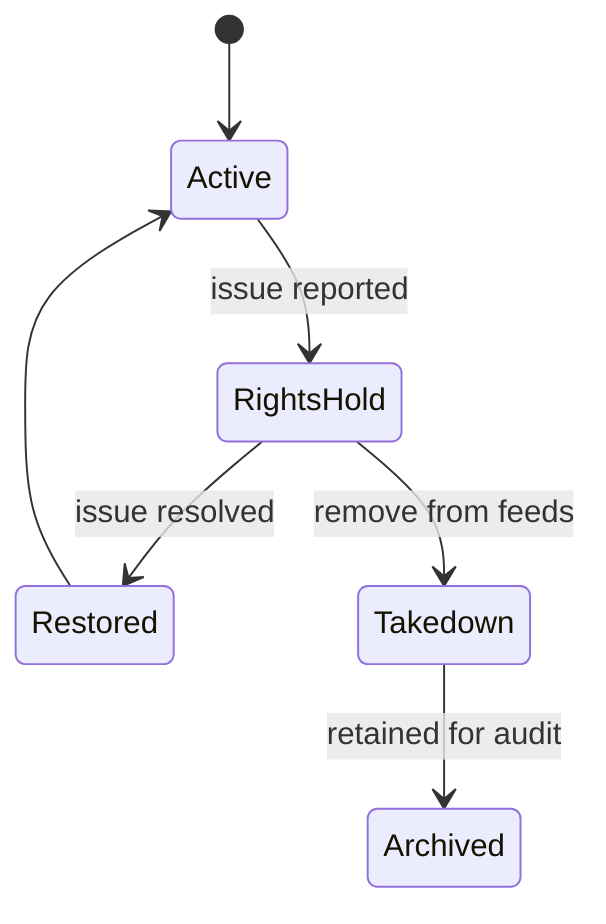

# Rights and Publication Policy

## 1. Policy Statement

Podcast Hub may publish only content that the operator owns, is licensed to distribute, or is otherwise authorized to publish.

The platform must not be used to bypass:

- Paywalls.
- DRM.
- Authentication controls.
- CAPTCHA.
- Platform restrictions.
- Access controls.
- Terms that prohibit redistribution.

## 2. Rights Responsibilities

### 2.1 System Owner

The System Owner defines platform-wide rights policy, audit requirements, and publication guardrails.

### 2.2 Administrator

The Administrator records rights notes and configures publication scopes.

### 2.3 Reviewer

The Reviewer checks imported episodes for metadata quality, duplicate risk, and rights concerns before approval.

### 2.4 Operator

The Operator may run imports and resolve authentication todos, but should not override rights holds unless explicitly authorized.

## 3. Rights Evidence

Each Program should record:

- Content owner or license holder.
- Allowed distribution scope.
- Allowed publication region, if relevant.
- Expiration date, if relevant.
- Source of authorization.
- Internal notes or document references.

Each Source should record:

- Why this Source is authorized.
- Whether media files can be stored by Podcast Hub.
- Whether external media references are allowed.
- Any source-specific redistribution limits.

Each Episode can inherit rights from Program and Source, but reviewers may add episode-level notes.

## 4. Publication Scopes

### 4.1 Private

Available only to internal owners or selected internal users.

Use for:

- Draft review.
- Internal QA.
- Restricted content testing.

### 4.2 Selected Users

Available only to explicitly authorized users or groups.

Use for:

- Paid users with valid entitlement.
- Partner access.
- Course cohorts.
- Internal teams.

### 4.3 Public

Available without user-specific authorization.

Use only when:

- Public distribution is authorized.
- Rights notes are complete.
- No rights hold exists.
- Review is approved.

## 5. Publication Gate

An episode can be included in a feed only when:

- Program is active.
- Source is active.
- Episode is approved.
- Rights notes are complete for the requested scope.
- Publication configuration is active.
- User or public access policy allows it.
- No takedown, compliance hold, or access block exists.

## 6. Review Rights Checks

Reviewers should check:

- Episode source matches configured Program and Source.
- Metadata does not misrepresent ownership.
- Media artifact is present or externally referenced according to policy.
- No warning indicates unauthorized access or unexpected restricted material.
- Duplicate candidates are resolved.
- Publication scope matches recorded rights.

Review decisions:

- `approve`: content can proceed to configured publication.
- `reject`: content should not be published.
- `needs_revision`: metadata or artifact must be corrected.
- `hold`: rights or policy status must be resolved.

## 7. RSS Authorization Policy

RSS authorization depends on active account state.

Rules:

- `pending_verification` users cannot access personal RSS feeds.
- `suspended` users cannot access personal RSS feeds.
- `deleted` users cannot access personal RSS feeds.
- `active` users can access only feeds allowed by current Program authorization.
- Admin role does not automatically grant redistribution rights.

### 7.1 Public RSS

Public RSS must include only approved episodes whose rights allow public distribution.

### 7.2 Selected-User RSS

Selected-user RSS must evaluate the current authorization of the requester on every RSS request.

Every request must validate:

- RSS Token.
- User status.
- Current Program or Collection access.
- Program publication state.
- Episode approval and publication eligibility.

If access is revoked:

- Future feed responses must exclude the revoked content.
- Personal feed tokens may be revoked or kept active with reduced content according to policy.
- Token revocation and permission revocation must take effect immediately.
- Cache must not bypass authorization checks.

### 7.3 Personal Collection RSS

Collection feeds must include only Programs currently authorized for the user.

If a user loses access to one Program:

- That Program's episodes disappear from the collection feed.
- The rest of the collection remains available if authorized.

## 8. Takedown and Hold

Takedown triggers:

- Rights complaint.
- License expiration.
- Source authorization revoked.
- Incorrect publication scope.
- Content owner request.
- Internal compliance decision.

Actions:

- Put Program, Source, Episode, or Publication on hold.
- Remove affected episodes from RSS generation.
- Preserve audit trail.
- Record reason and actor.
- Notify responsible administrators.

State machine:

## 9. Prohibited Scenarios

The platform must not support:

- Downloading or publishing content without authorization.
- Circumventing DRM.
- Circumventing paywalls.
- Circumventing CAPTCHA.
- Circumventing source authentication or access restrictions.
- Sharing one user's private access with another user.
- Logging or exporting cookies, tokens, passwords, or raw session data.
- Publishing content from revoked or rights-hold Sources.
- Public self-registration as administrator.
- Using account authentication as proof of content redistribution rights.
- Serving RSS content from cache without real-time authorization checks.
- Using external source URLs as default formal RSS enclosures without explicit policy.

## 10. Audit Requirements

Audit events are required for:

- User registration verification.
- Login and logout security events according to authentication policy.
- Password reset and session revocation.
- User role changes.
- User suspension and deletion.
- Program rights note changes.
- Source rights note changes.
- Publication scope changes.
- Review decisions.
- Takedown or hold actions.
- User access grants and revocations.
- RSS token regeneration or revocation.
- Connector approval, deprecation, or revocation.

Audit records should contain:

- Actor.
- Action.
- Target.
- Timestamp.
- Reason.
- Before and after summary.
- Redacted snapshots.

## 11. Retention

The platform should retain:

- Approved episode metadata while published.
- Historical review decisions.
- Import job logs according to retention policy.
- Audit logs according to compliance policy.
- Takedown records even after content is removed from active feeds.

Raw media retention should follow storage, rights, and privacy policy.

Storage baseline:

- Manual uploads and approved/published media later move to controlled S3-compatible object storage.
- Connector outputs first enter isolated staging.
- Unreviewed content never enters formal RSS.
- External source URLs are provenance by default.
- Failed job raw media artifacts are deleted immediately by default.
- Sanitized failed job logs and metadata are retained for 30 days by default.

See `STORAGE_POLICY.md`.
